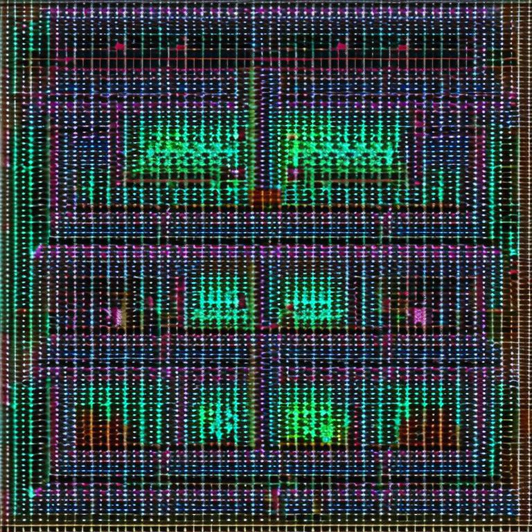

# MicroPyNet
An autograd engine for scalar values that performs automatic differentiation

 

## What is this?
- Is is an autograd engine for scalar values.
- Automatic differentiation is a technique used to compute gradients of functions with respect to their input variables.
- this engine can compute the derivative of a scalar function
- and in neural networks this can be used to compute the gradient of the loss funtion with respect to the parameters which needs to be updated

